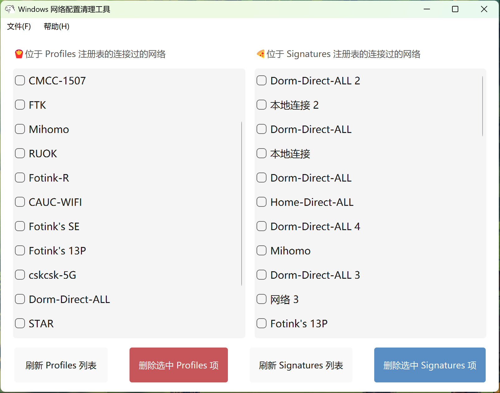

# deleteNetworkProfile
删除 Windows 下的多余的网络配置文件的小工具

### 原理

操作 **HKEY_LOCAL_MACHINE\SOFTWARE\Microsoft\Windows NT\CurrentVersion\NetworkList\Signatures\Unmanaged** 和 **HKEY_LOCAL_MACHINE\SOFTWARE\Microsoft\Windows NT\CurrentVersion\NetworkList\Profiles** 两处注册表位置，读取其中的子项，用户选中后，即对其进行删除处理

### 技术栈

**PySide 6** + **Python 3.11**

release 打包使用 **PyInstaller** + **auto-py-to-exe**